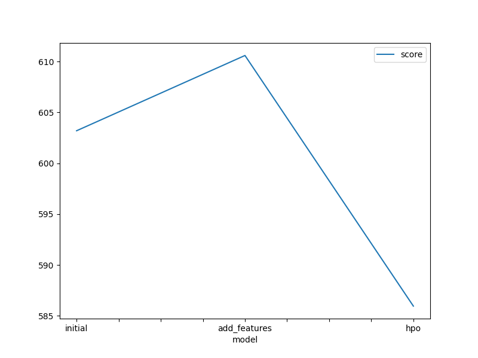
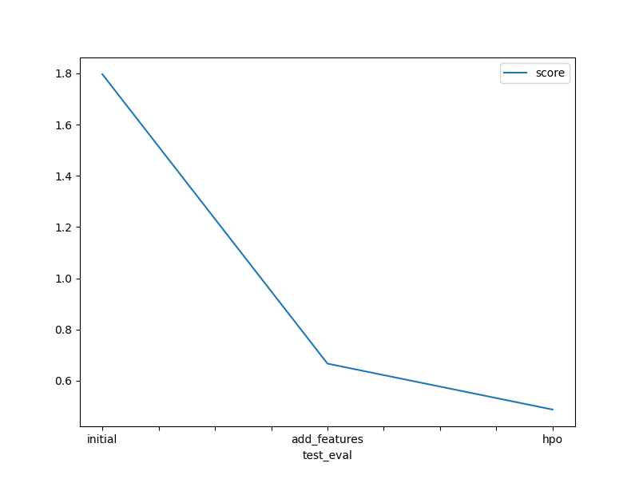

# Report: Predict Bike Sharing Demand with AutoGluon Solution
#### Vishnu Anurag Thonukunoori

## Initial Training
### What did you realize when you tried to submit your predictions? What changes were needed to the output of the predictor to submit your results?
The first time when I used the dataset without perfoming any EDA or feature engineering ,the model did not perform as well as expected because it had a lot of errors, I forgot, that in order to be able to submit my results to kaggle I needed to replace the negative numbers with 0.

### What was the top ranked model that performed?
WeightedEnsemble_L3 model from created features

## Exploratory data analysis and feature creation
### What did the exploratory analysis find and how did you add additional features?
For the extra features I divided the datetime in month, day, year and hour. Also I transformed  the season and weather features to categorical.

### How much better did your model preform after adding additional features and why do you think that is?
Because additional features can be good predictors to estimate the target value, in this case I decided to separate the date becuase it helps the model to analyse seasonality paterns in the data which can be usefull for a regression model

## Hyper parameter tuning
### How much better did your model preform after trying different hyper parameters?
Hyper parameter tuning was useful in some cases but it did not improve model performance by much,it kept on reducing the model performance after some time with more complex hyperparameters.

### If you were given more time with this dataset, where do you think you would spend more time?
Do a more extensive data analysis in order to acquire more information from this dataset , research more and better hyperparameters and even train the model with a more complex structure. 

### Create a table with the models you ran, the hyperparameters modified, and the kaggle score.
|model|hpo1|hpo2|hpo3|score|
|--|--|--|--|--|
|initial|default_vals|default_vals|default_vals|1.79651|
|add_features|default_vals|default_vals|default_vals|0.66670|
|hpo|num_leaves: lower=26, upper=66|dropout_prob: 0.0, 0.5|num_boost_round: 100|0.48738|

### Create a line plot showing the top model score for the three (or more) training runs during the project.

TODO: Replace the image below with your own.

### Create a line plot showing the top kaggle score for the three (or more) prediction submissions during the project.

TODO: Replace the image below with your own.

## Summary
In this project I was able to apply all the concepts that were covered in the first unit of the course, by using this skills I was able to develop a machine learning regression model using autogluon framework, In the end ,The results were good because the kaggle score of my model was on-par with proffesional kagglers.
